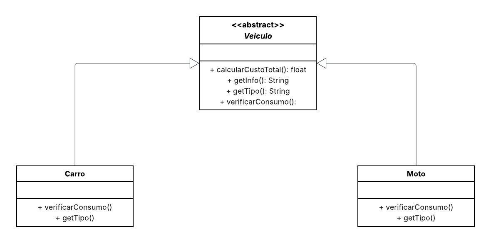

## 🚗 Sistema de Cálculo de Custo de Viagem
Este projeto implementa o padrão de projeto comportamental Template Method.
O objetivo é simular a definição de um "esqueleto" de operações na classe abstrata Veiculo (como calcularCustoTotal e getInfo), e forçar as subclasses (Carro e Moto) a implementarem seus próprios comportamentos específicos (o método abstrato verificarConsumo).
O projeto aplica o princípio Open/Closed (Aberto para extensão, fechado para modificação), permitindo que novos tipos de veículos (como Caminhao ou Bicicleta) sejam adicionados, cada um com sua lógica de "consumo", sem precisar alterar o código da classe base Veiculo.

## 📌 Diagrama de Classes

## 👩‍💻 Autora
**Eduarda Araujo Carvalho** 
